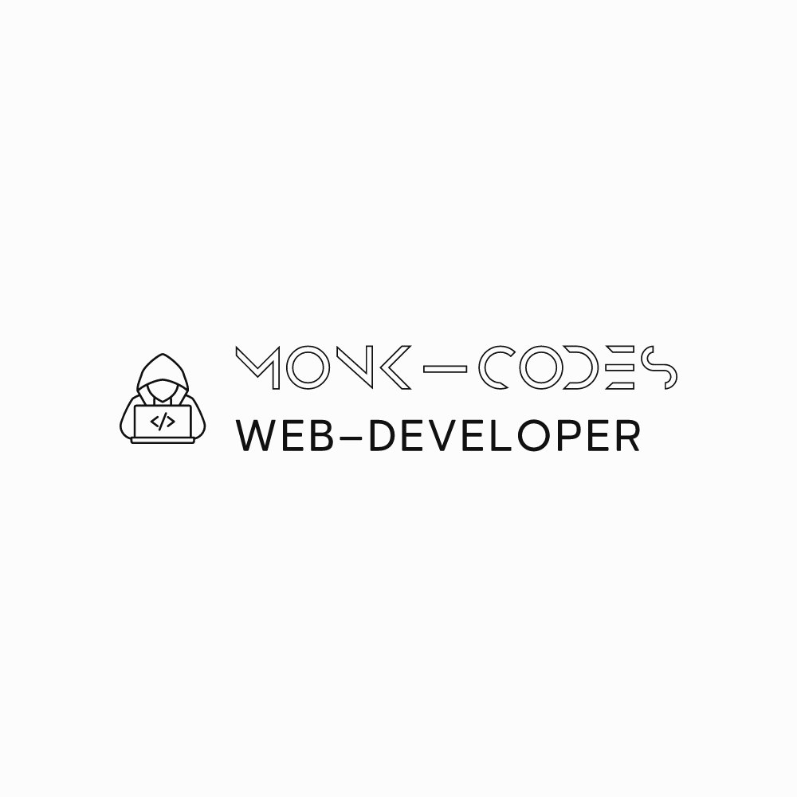

# SUPERHERO UNIVERSE 🪐
## SEARCH THROUGH ALL SUPERHEROS KNOWN TILL NOW...
- [Live Demo](https://superhero-universe.netlify.app/)
 

  
  <h3 align="center">SuperHero-Universe 🪐</h3>

  

    Superheros OF All Time 
     
     
    <a href="https://github.com/Monk-Codes/SuperHero-Universe"><strong>SEARCH THROUGH ALL SUPERHEROS KNOWN TILL NOW...</strong></a>
     
     
    <a href="https://github.com/Monk-Codes/SuperHero-Universe">View Demo</a>
    .
    <a href="https://github.com/Monk-Codes/SuperHero-Universe/issues">Report Bug</a>
    .
    <a href="https://github.com/Monk-Codes/SuperHero-Universe/issues">Request Feature</a>
  

  

## Table Of Contents

* [About the Project](#about-the-project)
* [Built With](#built-with)
* [Getting Started](#getting-started)
* [Roadmap](#roadmap)
* [Authors](#authors)
* [Acknowledgements](#acknowledgements)

## About The Project

Here's why:

* Your time should be focused on creating something amazing. A project that solves a problem and helps others
* You shouldn't be doing the same tasks over and over like creating a README from scratch
* You should element DRY principles to the rest of your life :smile:

 So I'll be adding more in the near future. You may also suggest changes by forking this repo and creating a pull request or opening an issue.

A list of commonly used resources that I find helpful are listed in the acknowledgements.

## Built With

HTML | CSS | REACT

## Getting Started

This is an example of how you may give instructions on setting up your project locally.
To get a local copy up and running follow these simple example steps.

## Roadmap

See the [open issues](https://github.com/Monk-Codes//issues) for a list of proposed features (and known issues).

### Creating A Pull Request

1. Fork the Project
2. Create your Feature Branch (`git checkout -b feature/AmazingFeature`)
3. Commit your Changes (`git commit -m 'Add some AmazingFeature'`)
4. Push to the Branch (`git push origin feature/AmazingFeature`)
5. Open a Pull Request

## Authors

* **Monk-Codes** - *FRONTEND DEVELOPER* - [Monk-Codes](https://github.com/Monk-Codes) - **
